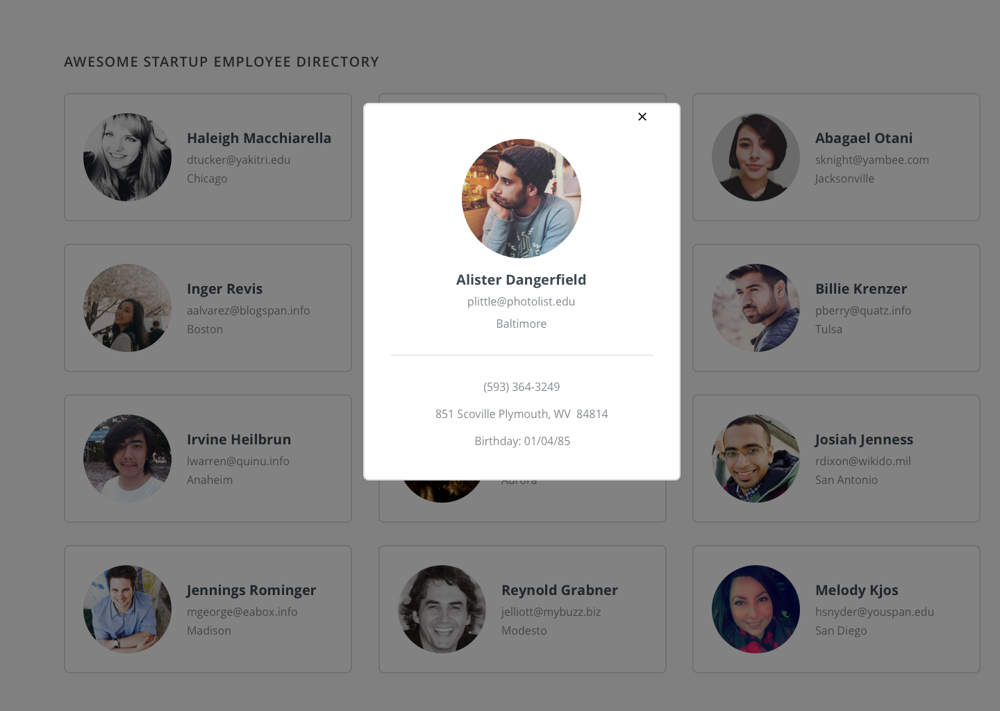

# Techdegree Project 10

## Requirements
1.  Follow the mockups
2.  Load the employee directory with data from a random user API
3.  Make the users searchable
4.  When clicking on the user it will open in a dialog box

## Mockups
### Directory

### Overlay

